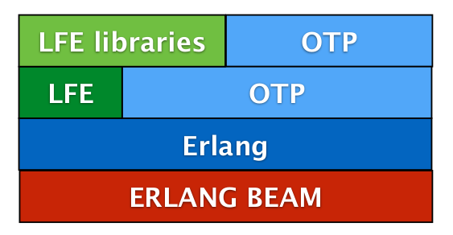

# LFE


Alien technology on BEAM

---

## What's a Lisp?

1. Numbers
  ```lfe
  1
  ```
2. Symbols
  ```lfe
  'a
  ```
3. Lists
  ```lfe
  '(a b c)
  '(1 2 3)
  ```
4. More lists
  ```lfe
  '(1 a (1 2 3) (a b c))
  '((a 1) (b 2) (c 3))
  ```

---

## I was told there would be functions

Luckily, functions are just lists too:

```lfe
(defun hello ()
  (io:format "Hello, World!"))
```

Or a more erlangy helloworld: 

```lfe
(defun hello-server ()
  (spawn (lambda ()
    (receive
      ((tuple sender 'hello)
       (! sender "Hello to you too!"))))))

(defun hello-client () 
  (! (hello-server)
     (tuple (self) hello)))
```

---

## What's with the apostrophes?

Because code is data and vice versa, quoting denotes what should and shouldn't be evaluated:

```lfe
(defun im-a-function ()
  (+ 2 2))

'(defun im-just-a-list ()
   (+ 2 2))
```

If that wasn't confusing enough, the backquote (or quasiquote) allows unquoting:

```lfe

(defun list-quoted (arg1 arg2)
  '(arg1 arg2))

(defun list-unquoted (arg1 arg2)
  `(,arg1 ,arg2))

(list-quoted 1 2)
; (arg1 arg2)
(list-unquoted 1 2)
; (1 2)
```

---

## Okay, so it's Lisp Flavored, but where's the Erlang?

LFE is in essence just an Erlang library.



---

## Erlang idioms in Lisp, not the other way around.

```lfe
(defun universal-server ()
  (receive
    ((tuple 'become server-function)
     (funcall server-function))))

(defun factorial
  ((0) 1)
  ((number) (* number (factorial (- number 1)))))

(defun factorial-server ()
  (receive
    ((tuple sender number)
     (! sender (factorial number))
     (factorial-server))))

(defun run-it ()
  (let ((pid (spawn #'universal-server/0)))
    (! pid (tuple 'become #'factorial-server/0))
    (! pid (tuple (self) 50)))
  (receive
    (data data)))
```

---
